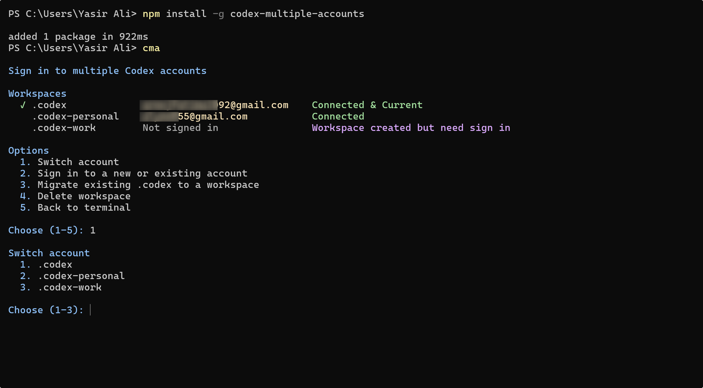

# Codex multiple accounts

Manage multiple isolated Codex CLI workspaces from a terminal dashboard. Codex CLI must already be installed.



## Use

```sh
# Global installation
npm install -g codex-multiple-accounts

# Open the dashboard (same as `cma dashboard`)
cma

# Optional quick commands - if not use dashboard
cma login <workspace-name>                   # Sign in to a workspace
cma login <workspace-name> --device-auth     # Sign in using device authentication
cma run <workspace-name>                     # Start Codex in a workspace
cma status <workspace-name>                  # Check whether a workspace is signed in
cma migrate <workspace-name>                 # Move .codex to .codex-<workspace-name>
```

## Workspaces

Choose any workspace name, such as `01`, `personal` or `work`. Each workspace has its own Codex home, which keeps its sign-in, settings, and local history separate. By default, workspace data is stored in `~/.codex-<workspace>`; set `CODEX_ACCOUNTS_HOME` to store workspaces somewhere else.

The dashboard lists local workspaces, shows whether they are connected, and displays the email for connected ChatGPT accounts. The email is read locally from Codex and is not saved separately by this tool. To delete a workspace, choose it from the dashboard and confirm by typing its folder name.

## Migrate

Your existing `~/.codex` profile is left as-is until you choose the dashboard’s migration option or run `cma migrate <workspace-name>`. Migration renames `.codex` to `.codex-<workspace-name>`, preserving its sign-in, settings, and local history. Migration stops if the destination workspace already exists.

## Requirements

Install Codex CLI first and ensure the `codex` command is available in your terminal. This independent community project is not affiliated with or endorsed by OpenAI. It uses the installed Codex CLI and its documented [App Server](https://learn.chatgpt.com/docs/app-server) account interface.

## Troubleshooting sign-in

You may occasionally see this error while signing in:

```text
Error logging in: An attempt was made to access a socket in a way forbidden by its access permissions. (os error 10013)
```

This is a Windows socket permissions error from Codex authentication during sign-in, not an error from this tool. To fix it, search for **Command Prompt**, choose **Run as administrator**, then run:

```bat
net stop winnat
net start winnat
```

After that, try signing in again.
